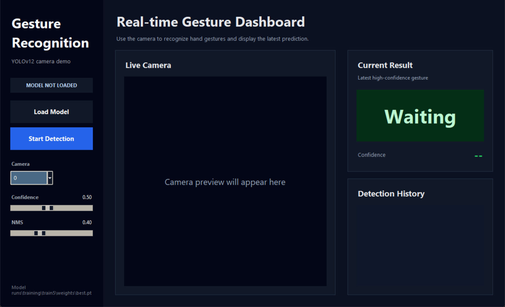
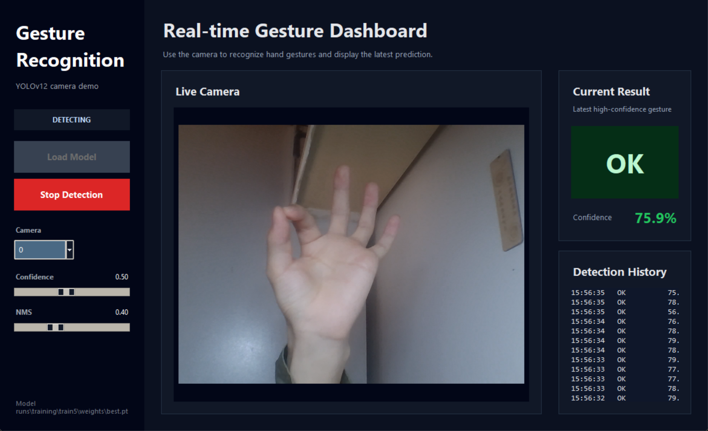
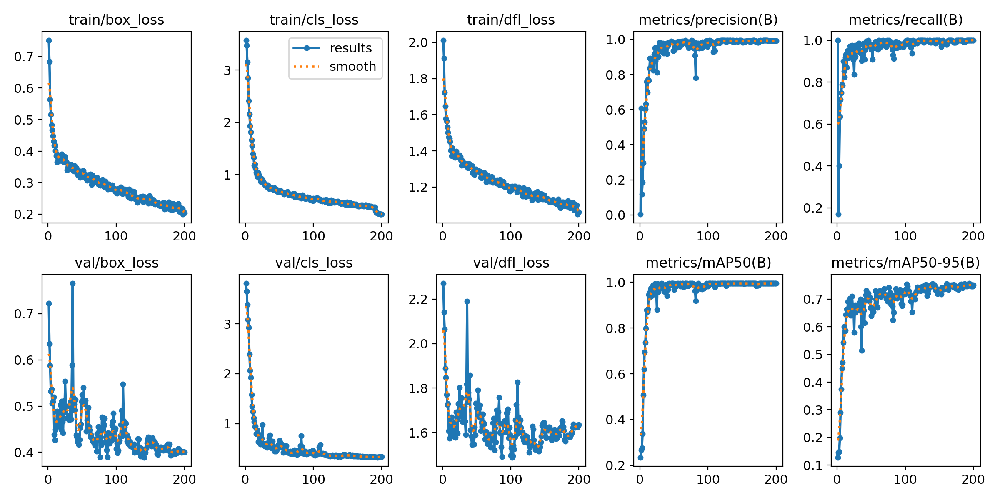
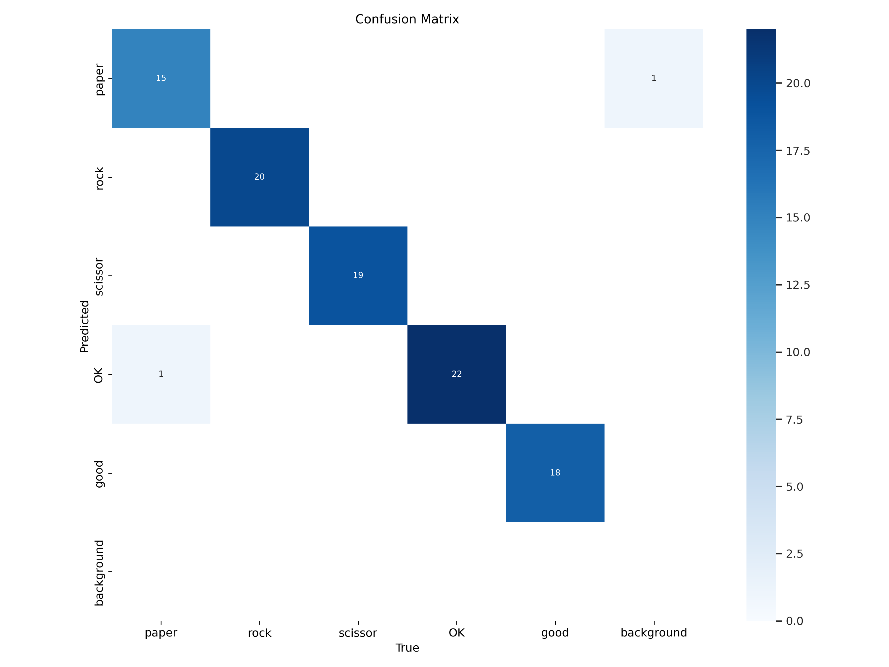

# GestureRecognition

## 项目简介

GestureRecognition 是一个基于 Python、YOLOv12、OpenCV 和 Tkinter 开发的实时手势识别系统。项目通过训练 YOLO 目标检测模型，实现对摄像头画面中手势的实时检测与识别，并提供图形化界面用于模型加载、摄像头检测和识别结果显示。本项目适合大二同学作为计算机视觉、目标检测、深度学习实践和课程设计项目。

---

## 支持识别的手势类别

本项目支持以下 5 类手势识别：

| 类别编号 | 0 | 1 | 2 | 3 | 4 |
|:---:|:---:|:---:|:---:|:---:|:---:|
| 类别名称 | rock | paper | scissors | OK | good |
| 中文含义 | 石头 | 布 | 剪刀 | OK 手势 | 点赞手势 |

---

## 项目功能

| 功能 | 说明 |
|:---:|:---:|
| 模型加载 | 加载训练完成的 YOLO 手势识别模型 |
| 实时检测 | 调用摄像头获取实时画面并进行推理 |
| 结果显示 | 显示识别类别、检测框和置信度 |
| 图形界面 | 提供 Tkinter 可视化操作界面 |
| 数据处理 | 支持图片整理、标签整理和数据集划分 |
| 模型评估 | 支持对训练模型进行检测效果评估 |

---
## 项目展示

<table width="100%">
<tr>
<td width="50%" align="center">
<b>GUI 主界面</b><br>

</td>
<td width="50%" align="center">
<b>实时识别效果</b><br>

</td>
</tr>
<tr>
<td width="50%" align="center">
<b>训练结果</b><br>

</td>
<td width="50%" align="center">
<b>混淆矩阵</b><br>

</td>
</tr>
</table>

---

## 技术栈

| 技术 | Python | YOLOv12 | OpenCV | Tkinter | PyTorch | Pillow | NumPy |
|:---:|:---:|:---:|:---:|:---:|:---:|:---:|:---:|
| 作用 | 项目主要开发语言 | 手势目标检测模型 | 摄像头调用与图像处理 | 图形化界面 | 深度学习模型运行 | 图像格式转换与显示 | 数值计算 |

---

## 项目结构

```text
GestureRecognition/
├── configs/
│   └── gesture_dataset.yaml          # YOLO 数据集配置文件
│
├── src/
│   └── main.py                       # 图形化手势识别主程序
│
├── scripts/
│   ├── copy_images.py                # 图片整理脚本
│   ├── copy_labels.py                # 标签整理脚本
│   ├── split_dataset.py              # 数据集划分脚本
│   ├── evaluate.py                   # 模型评估脚本
│   └── detect_camera.py              # 摄像头实时检测脚本
│
├── models/
│   └── yolov12n.pt                   # YOLOv12 预训练模型
│
├── runs/
│   └── training/
│       └── train5/
│           └── weights/
│               └── best.pt           # 训练得到的最佳模型权重
│
├── docs/                             # README 展示图片文件夹
│   └── images/
│
├── requirements.txt                  # Python 依赖文件
├── .gitignore                      
└── README.md                      
```

---

## 环境要求

| 项目 | 要求 |
|:---:|:---:|
| Python 版本 | Python >= 3.9 |
| 操作系统 | Windows 10 / Windows 11 |
| 硬件要求 | 摄像头 |
| 主要依赖 | ultralytics、opencv-python、torch、torchvision、pillow、numpy、tqdm |

---

## 安装依赖

进入项目根目录后，执行：

```bash
pip install -r requirements.txt
```

---

## 运行项目

| 运行方式 | 命令 | 说明 |
|:---:|:---:|:---:|
| 方式一：图形化界面 | `python src/main.py` | 启动 GUI 界面，加载模型并启动摄像头后进行实时手势识别 |
| 方式二：摄像头检测脚本 | `python scripts/detect_camera.py` | 直接调用摄像头进行手势检测 |

---

## 数据集配置

数据集配置文件位于：`configs/gesture_dataset.yaml`

```yaml
path: datasets/gesture

train: train/images
val: val/images
test: test/images

nc: 5
names: ["rock", "paper", "scissors", "OK", "good"]
```

| 配置项 | 当前设置 | 说明 |
|:---:|:---:|:---:|
| `path` | `datasets/gesture` | 数据集根目录 |
| `train` | `train/images` | 训练集图片路径 |
| `val` | `val/images` | 验证集图片路径 |
| `test` | `test/images` | 测试集图片路径 |
| `nc` | `5` | 手势类别数量 |
| `names` | `rock` / `paper` / `scissors` / `OK` / `good` | 类别名称 |

---

## YOLO 标签格式

每张图片对应一个同名的 `.txt` 标签文件，标签采用 YOLO 标准格式：

```text
class_id x_center y_center width height
```

示例：

```text
0 0.512 0.438 0.267 0.354
```

| 字段 | 示例值 | 说明 |
|:---:|:---:|:---:|
| `class_id` | `0` | 手势类别编号 |
| `x_center` | `0.512` | 目标框中心点 x 坐标 |
| `y_center` | `0.438` | 目标框中心点 y 坐标 |
| `width` | `0.267` | 目标框宽度 |
| `height` | `0.354` | 目标框高度 |

所有坐标均为归一化后的相对坐标，取值范围为 `0 ~ 1`。

---

## 数据处理、训练与评估

| Step | Stage | Command |
|:---:|:---:|:---|
| ① | 数据整理 | `python scripts/copy_images.py`<br>`python scripts/copy_labels.py` |
| ② | 数据集划分 | `python scripts/split_dataset.py` |
| ③ | 模型评估 | `python scripts/evaluate.py` |

### 模型训练

```bash
yolo detect train \
  model=models/yolov12n.pt \
  data=configs/gesture_dataset.yaml \
  imgsz=640 \
  epochs=100 \
  batch=16 \
  project=runs/training \
  name=train5
```

最佳权重文件：`runs/training/train5/weights/best.pt`

---

## 后续改进方向

| 方向 | 说明 |
|:---:|:---:|
| 类别扩展 | 增加更多手势类别 |
| 界面优化 | 美化图形化界面，提高交互体验 |
| 语音播报 | 增加识别结果语音提示 |
| 手势控制 | 实现 PPT 翻页、音量调节等交互控制 |
| 模型部署 | 导出 ONNX，部署到 Web 或边缘设备 |

---


## 作者

⭐ 如果这个项目对你有帮助，欢迎 Star！

## License

本项目仅用于学习、课程设计和计算机视觉实验研究。

如需用于商业用途，请自行确认数据集、模型权重和第三方依赖的授权协议。
